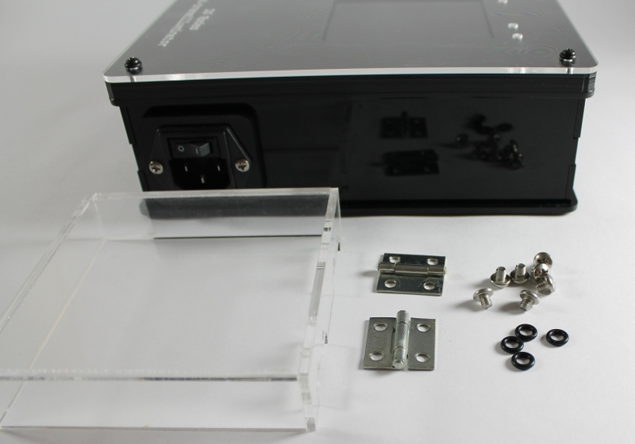
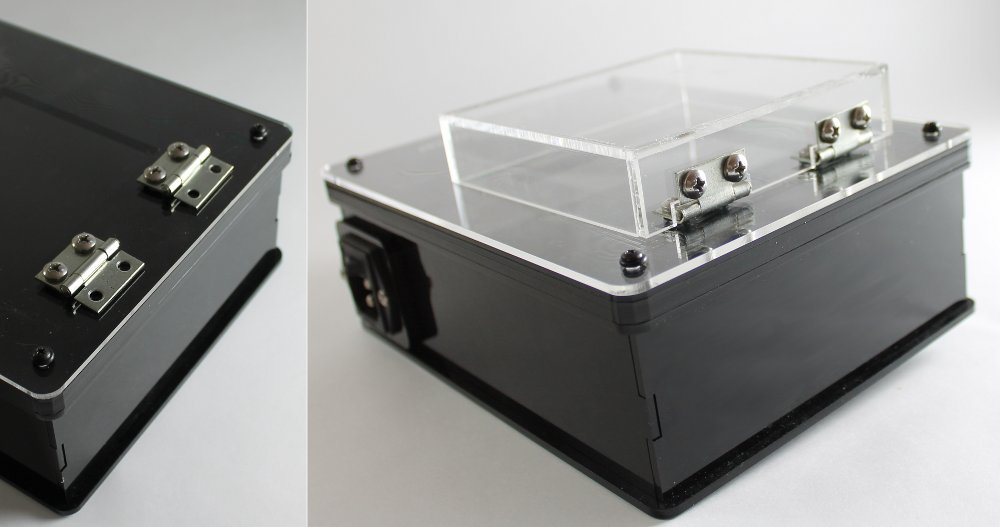

Assembly Step 4: Attach the lid
==================================

The kit comes with a clear [#f1]_ acrylic lid for viewing gels. This lid does not pass UV light and is designed to completely cover the viewing window area. 

Parts List
------------
* Assembled part from Step 3 
* Hardware Bag C 
* Acrylic lid

Instructions
------------------

* Place the four O-rings over the hinge holes. Line up the hinges and loosely attach the hinges to the top of the enclosure as shown using four of the hinge screws. Next, loosely attach the two hinges to the lid using the remaining screws. Once the lid is seated on the enclosure, tighten all of the screws.

.. rubric:: Footnotes

.. [#f1] Note, this lid can be swapped with an amber lid. When switching between lids, simply unscrew the hinges from the lid and replace it with the new lid.

